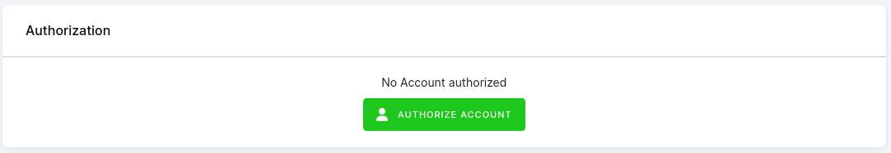

# DV360 Extractor

This data source component uses the Google Bid Manager API to create and run reports that measure the results of Display & Video 360 advertising campaigns. 
It automates data retrieval from the [Display&Video 360 Reports](https://marketingplatform.google.com/about/display-video-360/), allowing you to run
existing reports defined via the [DV360 Report Builder](https://support.google.com/displayvideo/answer/6375151?hl=en&ref_topic=2798432&sjid=18233030458040234650-EU)
or create ad-hoc reports directly from the configuration.


**Table of contents:**

[TOC]


## Prerequisites

Before using the connector, make sure the following prerequisites are met:

1. Get access to the [Display & Video 360](https://marketingplatform.google.com/about/display-video-360/) account.

2. Log in to your account using the Authorize Account button in the Keboola interface. 



## Configuration

The connector supports two modes:

1. Running and downloading an existing report definition. Such a report may be defined using the [DV360 Report Builder](https://support.google.com/displayvideo/answer/6375151?hl=en&ref_topic=2798432&sjid=15077049489643424211-EU).
   - This option is suitable when you need more control over the report definition.
2. Defining the report definition directly in the UI.
   - This allows you to define simple report definition directly in the configuration UI.
   - This mode will automatically create an offline report in the [DV360 console](https://displayvideo.google.com/ng_nav/reporting) that will be linked to the configuration. The naming convention of the created report is: `keboola_generated_{PROJECT_ID}_{CONFIG_ID}_{ROWID}`

### Running an existing report

1. Define your report in the [DV360 Report Builder](https://displayvideo.google.com/ng_nav/reporting). See the official [docs](https://support.google.com/displayvideo/answer/6375151?hl=en&ref_topic=2798432&sjid=15077049489643424211-EU).
2. Select the `Existing report ID` in the `Report definition mode` configuration option.
3. Select the existing report ID from the dropdown of available reports.
4. Define the desired `Time Range`.
   - You may select either a predefined period or a `Custom Date Range`.
   - This option allows you to define a relative report period range.
5. Define the **destination** parameters to control how the result is stored. See the `Destination` section.

### Defining a report directly in the UI

1. Select the `Report specification` in the `Report definition mode` configuration option.
2. Define your report in  `Report Details`.
   1. Select the `Report Type`.
   2. Select the desired dimensions.
   3. Select the desired metrics.
   4. Optionally, specify filters.
3. Define the desired `Time Range`.
   - You may select either a predefined period or a `Custom Date Range`.
   - This option allows you to define a relative report period range.
4. Define the **destination** parameters to control how the result is stored. See the `Destination` section.


### Destination - report output

This section defines how the extracted data will be saved in Keboola Storage.

- **Load Type** – If `Full Load` is used, the destination table will be overwritten every run. If `Incremental Load` is used, data will be “upserted” into the destination table.
- **Storage Table Name** – The name assigned to the table in Keboola Storage.
- **Primary Key** - Since the reports are always custom-defined, you need to define what dimensions (columns) represent the unique primary key. This is then used to perform "upserts".
  - Note that if the primary key is not defined properly, you may lose some data during deduplication. If there is no primary key defined and `Incremental Load` mode is used, each execution will lead to a new set of records.


# Technical Details


The component uses version 2 of the Google Bid Manager API.

- `https://doubleclickbidmanager.googleapis.com`

It handles 2 resource types:
- v2.queries - [see reference to queries](https://doubleclickbidmanager.googleapis.com)
- v2.queries.reports - [see reference to reports](https://developers.google.com/bid-manager/reference/rest#rest-resource:-v2.queries.reports)


## Features

| **Feature**             | **Note**                                      |
|-------------------------|-----------------------------------------------|
| Generic UI form         | Dynamic UI form                               |
| Row Based configuration | Allows structuring the configuration in rows. |
| oAuth                   | oAuth authentication enabled                  |
| Incremental loading     | Allows fetching data in new increments.       |
| Dimension filter        | Fetch data of certain dimension values only.  |
| Date range filter       | Specify date range.                           |


## Sample Raw Configuration

```json
{
    "storage": {
        "input": {
            "files": [],
            "tables": [
                {
                    "source": "in.c-test.test",
                    "destination": "test.csv",
                    "limit": 50,
                    "columns": [],
                    "where_values": [],
                    "where_operator": "eq"
                }
            ]
        },
        "output": {
            "files": [],
            "tables": []
        }
    },
    "parameters": {
        "time_range": {
            "period": "CUSTOM_DATES",
            "date_from": "120 days ago",
            "date_to": "today"
        },
        "destination": {
            "table_name": "report_row_1",
            "incremental_loading": true,
            "primary_key": [
                "FILTER_ADVERTISER",
                "FILTER_ADVERTISER_NAME",
                "FILTER_BROWSER"
            ]
        },
        "input_variant": "report_specification",
        "report_specification": {
            "filters": [
                {
                    "name": "FILTER_ADVERTISER",
                    "value": "630317194"
                }
            ],
            "metrics": [
                "METRIC_CLICKS",
                "METRIC_COUNTERS",
                "METRIC_ENGAGEMENTS"
            ],
            "dimensions": [
                "FILTER_ADVERTISER",
                "FILTER_ADVERTISER_NAME",
                "FILTER_BROWSER"
            ],
            "report_type": "YOUTUBE"
        },
        "existing_report_id": "",
        "debug": false
    },
    "image_parameters": {
        "syrup_url": "https://syrup.keboola.com/"
    },
    "authorization": {
        "oauth_api": {
            "id": "OAUTH_API_ID",
            "credentials": {
                "id": "main",
                "authorizedFor": "Myself",
                "creator": {
                    "id": "1234",
                    "description": "me@keboola.com"
                },
                "created": "2016-01-31 00:13:30",
                "#data": "{\n    \"access_token\": \"ya29.a0AX9GBdWIPO_vxymZ6TnTLNp3ZBzWYbgL2CZ13SDS64V1hWm0C7nk-X4OQ7sCMSKxZQFP5oOHrWef5Yu1f_eZMmoBOS6ddDOxPSKp3xAG1QI1nrIe-CgpTg0EEKiB7vLa9IRv7cWQ-jO41dfHTWCw6iPdvojdaCgYKAQQSARMSFQHUCsbC5wpREHiB4-rzu7tQFgTmfA0163\",\n    \"scope\": \"https://www.googleapis.com/auth/doubleclickbidmanager\",\n    \"token_type\": \"Bearer\",\n    \"expires_in\": 3599,\n    \"refresh_token\": \"1//04AWs1av4uUF2CgYIARAAGAQSNwF-L9IrOqig-Xyig3ckKS_BEnvnd_JMneoJMdZPr5lxmLkWIzDV4-c_e_O5xS6fThkWlIkvatc\"\n}",
                "oauthVersion": "2.0",
                "appKey": "306269445270-icka3qa2liqrbkinij89v6uk1e1e21nd.apps.googleusercontent.com",
                "#appSecret": "KgAZGxKZ1RGVoGbNbDE-DclC"
            }
        }
    },
    "action": "validate_query"
}
```

Output
======

List of tables, foreign keys, and a schema.

Development
-----------

If required, change the local data folder (the `CUSTOM_FOLDER` placeholder) path to your custom path in
the `docker-compose.yml` file:

~~~~~~~~~~~~~~~~~~~~~~~~~~~~~~~~~~~~~~~~~~~~~~~~~~~~~~~~~~~~~~~~~~~~~~~~~~~~~~~~
    volumes:
      - ./:/code
      - ./CUSTOM_FOLDER:/data
~~~~~~~~~~~~~~~~~~~~~~~~~~~~~~~~~~~~~~~~~~~~~~~~~~~~~~~~~~~~~~~~~~~~~~~~~~~~~~~~

Clone this repository, init the workspace and run the component with the following command:

~~~~~~~~~~~~~~~~~~~~~~~~~~~~~~~~~~~~~~~~~~~~~~~~~~~~~~~~~~~~~~~~~~~~~~~~~~~~~~~~
docker-compose build
docker-compose run --rm dev
~~~~~~~~~~~~~~~~~~~~~~~~~~~~~~~~~~~~~~~~~~~~~~~~~~~~~~~~~~~~~~~~~~~~~~~~~~~~~~~~

Run the test suite and lint checks using this command:

~~~~~~~~~~~~~~~~~~~~~~~~~~~~~~~~~~~~~~~~~~~~~~~~~~~~~~~~~~~~~~~~~~~~~~~~~~~~~~~~
docker-compose run --rm test
~~~~~~~~~~~~~~~~~~~~~~~~~~~~~~~~~~~~~~~~~~~~~~~~~~~~~~~~~~~~~~~~~~~~~~~~~~~~~~~~

Integration
===========

For information about deployment and integration with Keboola, refer to the
[deployment section in our developer documentation](https://developers.keboola.com/extend/component/deployment/).